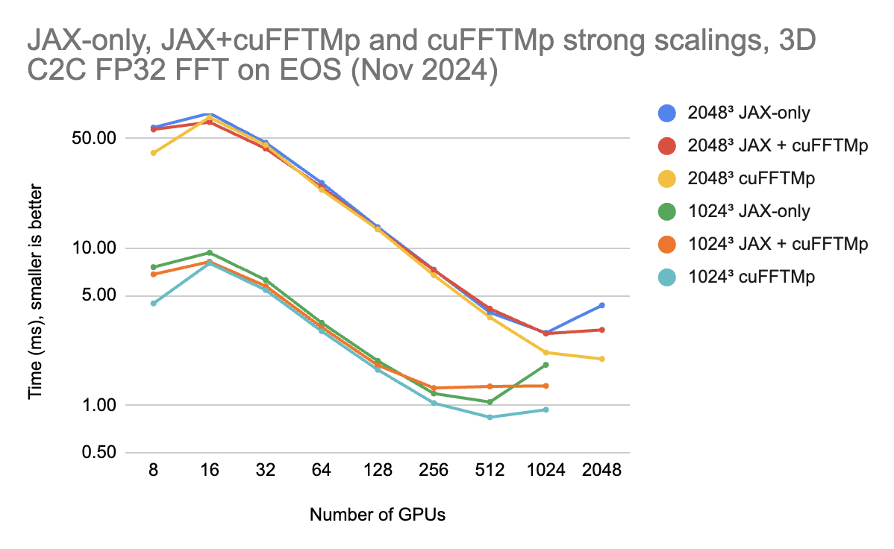

# FFT + JAX

This code sample shows how to compute FFTs at scale with JAX.

Specifically, it shows how to do multi-GPUs-multi-nodes (MGMN) FFTs in two ways
1. `JAX-only`: using JAX-only tools: `jax.numpy.fft`, `custom_partitioning` and `jit`. Those are all out-of-the-box JAX APIs.
2. `JAX+cuFFTMp`: using [cuFFTMp](https://docs.nvidia.com/hpc-sdk/cufftmp/index.html), a MGMN extension to [cuFFT](https://docs.nvidia.com/cuda/cufft/) based on [NVSHMEM](https://docs.nvidia.com/nvshmem/api/) which supports distributed FFTs with one-GPU-per-process. This is done using a JAX distributed-memory custom operation.

# Dependency

1. cuFFTMp
- cuFFTMp is available in the HPC SDK which can be downloaded [here](https://developer.nvidia.com/nvidia-hpc-sdk-downloads). This sample was tested with cuFFTMp 11.2.6 @ CUDA 12 in HPC SDK 24.7.

2. NVSHMEM
- NVSHMEM is also available in the HPC SDK which can be downloaded [here](https://developer.nvidia.com/nvidia-hpc-sdk-downloads). NVSHMEM can also be downloaded as a standalone package from [here](https://developer.download.nvidia.com/compute/redist/nvshmem/). This sample was tested with NVSHMEM 3.0 @ CUDA 12.

Note that early versions of cuFFTMp are compatible only with specific versions of NVSHMEM. Starting from cuFFTMp 11.2.6, NVSHMEM 3.0+ can be used. For details on cuFFTMp/NVSHMEM compatibility, see [here](https://docs.nvidia.com/hpc-sdk/cufftmp/usage/nvshmem_and_cufftmp.html#).

# Quick start (with Docker)

1. Clone the repo
2. Install [cuFFTMp](https://docs.nvidia.com/hpc-sdk/cufftmp/index.html) in `./cufftmp` and [NVSHMEM](https://docs.nvidia.com/nvshmem/api/) in `./nvshmem`. This means 

- `nvshmem.h` should be in `./nvshmem/include/`,
- `libnvshmem_host.so` should be in `./nvshmem/lib/`, 
- `cufftMp.h` should be in `./cufftmp/include/`, and 
- `libcufftMp.so` should be in `./cufftmp/lib/`.

    E.g., with HPC SDK 24.7 (and future versions), you can find them at
    ```
    <HPC SDK>/Linux_x86_64/<HPC SDK version>/math_libs/<CUDA version>/nvshmem/include/ --> nvshmem/include/
    <HPC SDK>/Linux_x86_64/<HPC SDK version>/comm_libs/<CUDA version>/nvshmem/lib/ --> nvshmem/lib/
    <HPC SDK>/Linux_x86_64/<HPC SDK version>/math_libs/<CUDA version>/include/cufftmp/ --> cufftmp/include/
    <HPC SDK>/Linux_x86_64/<HPC SDK version>/math_libs/<CUDA version>/lib64/ --> cufftmp/lib/
    ```
    For earlier versions of HPC SDK, see [cuFFTMp doc](https://docs.nvidia.com/hpc-sdk/cufftmp/usage/nvshmem_and_cufftmp.html#hpc-sdk-cufftmp-and-nvshmem) for locating compatible versions of NVSHMEM in HPC SDK.

3. Build
```
$ docker build -t fft_jax .
```
4. Assuming 4 GPUs are available on the machine, the following runs a performance test on `1024 x 1024 x 1024` tensor with the `JAX+cuFFTMp` implementation
```
$ docker run --gpus all fft_jax mpirun -n 4 python3 /fft_jax/tests/fft_test.py cufftmp perf -n 1024 --multiprocess=bootstrap
...
cufftmp (perf): (1024, 1024, 1024), num GPUs 4, num processes 4, relative L2 error 0.00e+00, cycles 10, time_avg 1.22e+01 ms, time_med 1.22e+01 ms, time_std 5.92e-02 ms, time_min 1.21e+01 ms, time_max 1.23e+01 ms, perf 1.32e+04 GFlop/s, bandwidth 1.76e+02 GB/s/GPU
&&&& PASSED
```
This shows that it took in average `12.2ms` to run each FFT, with an overall throughput of `13.2 TFlop/s`.

To run using a `JAX-only` implementation, `xfft`,
```
$ docker run --gpus all fft_jax mpirun -n 4 python3 /fft_jax/tests/fft_test.py xfft perf -n 1024 --multiprocess=bootstrap
...
xfft (perf): (1024, 1024, 1024), num GPUs 4, num processes 4, relative L2 error 0.00e+00, cycles 10, time_avg 1.43e+01 ms, time_med 1.37e+01 ms, time_std 1.76e+00 ms, time_min 1.35e+01 ms, time_max 1.95e+01 ms, perf 1.13e+04 GFlop/s, bandwidth 1.50e+02 GB/s/GPU
```
where we see that performances are very similar.

# Quick start (without Docker)

1. Perform step #1 and #2 as described above
2. Install JAX
```
python3.8 -m pip install --upgrade "jax[cuda]" -f https://storage.googleapis.com/jax-releases/jax_cuda_releases.html
```
3. Build
```
pip install -e .
```
4. Run, for instance with cuFFTMp
```
$ export LD_LIBRARY_PATH=$(pwd)/nvshmem/lib:$(pwd)/cufftmp/lib:$LD_LIBRARY_PATH
$ NVSHMEM_BOOTSTRAP=MPI mpirun -n 4 python3 ./tests/fft_test.py cufftmp perf -n 1024 --multiprocess=bootstrap
```

# Benchmarks

### JAX 0.4.36 + cuFFTMp 11.2.6 on H100s
The following plots show performances of both implementations at scale on the NVIDIA [EOS](https://www.top500.org/system/180239/) cluster, compared against cuFFTMp.
Results were obtained with cuFFTMp 11.2.6 and JAX 0.4.36. 

The plot shows strong scaling results for two problem sizes: `1024 x 1024 x 1024` and `2048 x 2048 x 2048`. We use `median` (instead of `average`) of 10 cycles to collect the time for each transform. We see that both implementations strong scale well, with `JAX + cuFFTMp` slightly outperforming `JAX-only` on single-node and many-nodes.



### JAX 0.4.1 + cuFFTMp 11.0.5 on A100s
The following plots show performances of both implementations at scale on the NVIDIA [Selene](https://www.top500.org/system/179842/) cluster, compared against cuFFTMp.
Results were obtained with cuFFTMp 11.0.5 and JAX 0.4.1.

The first plot (note the log scale) shows strong scaling results for two problem sizes: `1024 x 1024 x 1024` and `2048 x 2048 x 2048`. We see that both implementations strong scale well, with `JAX + cuFFTMp` outperforming `JAX-only` on single-node and many-nodes.


This second plot shows weak scalings, with the largest FFTs that can fit on a given set of GPUs. Again, both implementations weak scale well at all scales. Those numbers can be compared to numbers published [here](https://developer.nvidia.com/blog/multinode-multi-gpu-using-nvidia-cufftmp-ffts-at-scale/)


# How does it work?

Distributed FFT on an array of size `X x Y x Z` are done by sharding (distributing) the array initially along `X`. Then:
1. Given a local `(X // nGPUs, Y, Z)` array, compute local FFTs along `Y` and `Z`;
2. Re-shard (re-distribute) the array along `Y`;
3. Given a local `(X, Y // nGPUs, Z)` array, compute local FFTs along `X`.
The output is then an array sharded along `Y`.

The reverse direction is also possible, and implemented in this example, but for simplicity we focus on the shared along `X` -> `Y` path in the following.

## `JAX-only`

`JAX-only` relies on 
1. `jax.numpy.fft.fft`, to compute local FFTs;
2. `custom_partitioning` to ensure that the array is *not* replicated when calling `jax.numpy.fft.fft` on a sharded array. The reason for this is that, by default, `jax.numpy.fft.fft` does not understand sharding and will replicate the global array on all GPUs before computing FFTs.

Given this, for a global shape of `(X, Y, Z)`, the implementation works by defining two functions
1. `fft_Y` computes FFTs along `Y` and `Z` and requires its input and output is sharded along `X`;
2. `fft_X` computes FFTs along `X` and requires its input and output is sharded along `Y`.

The algorithm is then as simple as calling `y = fft_X(fft_Y(x))` for an input `x`. JAX will automatically re-shard the input to math to the requirements of `fft_Y` and `fft_X`. If `x` is sharded along `X` and `y` along `Y`, this will only require a single communication phase and is generally optimal for distributed FFTs.


## `JAX+cuFFTMp`

`JAX+cuFFTMp` requires
1. Exposing `cuFFTMp` to Python. This is done in `src/cufftmp_jax/src` and is being built by `setup.py` and `src/cufftmp_jax/CMakeLists.txt`. The result of this is a sharded library with an interface based on Pybind11. This allows calling C++ and CUDA code directly from Python.
2. Creating an interface between JAX, `jit` and `cuFFTMp`. This is done in `src/cufftmp_jax/cufftmp_jax.py` and is similar to what is done for single-process custom op in JAX (see [here](https://jax.readthedocs.io/en/latest/Custom_Operation_for_GPUs.html) and also [here](https://github.com/dfm/extending-jax)). This also relies on `custom_partitioning` to express to JAX that the input to `JAX+cuFFTMp` is sharded along `X` and that the output is sharded along `Y`.

# Troubleshooting

If you see
```
src/mem/mem.cpp:591: non-zero status: 1 cuMemCreate failed
src/mem/mem.cpp:622: non-zero status: 7 add physical memory failed
src/mem/mem.cpp:591: non-zero status: 1 cuMemCreate failed
src/mem/mem.cpp:622: non-zero status: 7 add physical memory failed
...
```
this means JAX is preallocating too much memory and NVSHMEM does not have any left available. See [here](https://jax.readthedocs.io/en/latest/gpu_memory_allocation.html) for more information. To ask JAX to preallocate only up to 50% of the total available memory, add `XLA_PYTHON_CLIENT_MEM_FRACTION=0.5` in your environment. With `docker run`, this should be
```
$ docker run --gpus all -e XLA_PYTHON_CLIENT_MEM_FRACTION=0.5 fft_jax mpirun -n 4 python3 /fft_jax/tests/fft_test.py cufftmp perf -n 512 --multiprocess=bootstrap
```