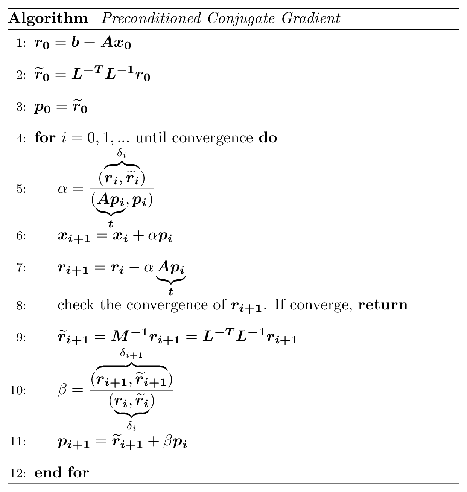

# Preconditioned Conjugate Gradient Method (CG)

## Description

This sample describes how to use the cuSPARSE and cuBLAS libraries to implement the Incomplete-Cholesky preconditioned iterative method **CG**.

[cuSPARSE Documentation](https://docs.nvidia.com/cuda/cusparse/index.html)

[cuBLAS Documentation](https://docs.nvidia.com/cuda/cublas/index.html)

#### Introduction

The solution of large sparse linear systems is an important problem in computational mechanics, atmospheric modeling, geophysics, biology, circuit simulation, and many other applications in the field of computational science and engineering. In general, these linear systems can be solved using direct or preconditioned iterative methods. Although the direct methods are often more reliable, they usually have large memory requirements and do not scale well on massively parallel computer platforms.

The iterative methods are more amenable to parallelism and therefore can be used to solve larger problems. Currently, the most popular iterative schemes belong to the Krylov subspace family of methods. They include Bi-Conjugate Gradient Stabilized (BiCGStab) and Conjugate Gradient (CG) iterative methods for non-symmetric and symmetric positive definite (s.p.d.) linear systems. We describe the CG method in more detail in the next section.

In practice, we typically use a variety of preconditioning techniques to improve the convergence of the iterative methods. In this sample, we focus on the Cholesky preconditioning which is one of the most popular of these preconditioning techniques. It computes an incomplete factorization of the coefficient matrix and requires a solution of lower system in every iteration of the iterative method.

In order to implement the preconditioned CG, we use the sparse matrix-vector multiplication and the sparse triangular solve implemented in the cuSPARSE library. We point out that the parallelism available in these iterative methods depends highly on the sparsity pattern of the coefficient matrix at hand.

Notice that in every iteration of the incomplete-Cholesky preconditioned CG iterative method, we need to perform one sparse matrix-vector multiplication and two triangular solves. The corresponding CG code using the cuSPARSE and cuBLAS libraries in the C programming language is shown below.

#### Preconditioned CG

<center>


the pdf version is also available [here](./cg.pdf)

the code contains the line references to the above algorithm
</center>

## Building

* Command line
    ```bash
    gcc -I<cuda_toolkit_path>/include cg_example.c -o cg_example -lcudart -lcusparse -lcublas
    ```

* Linux
    ```bash
    make
    ```

* Windows/Linux
    ```bash
    mkdir build
    cd build
    cmake ..
    make
    ```
    On Windows, instead of running the last build step, open the Visual Studio Solution that was created and build.

## Support

* **Supported SM Architectures:** SM 3.5, SM 3.7, SM 5.0, SM 5.2, SM 5.3, SM 6.0, SM 6.1, SM 6.2, SM 7.0, SM 7.2, SM 7.5, SM 8.0, SM 8.6, SM 8.9, SM 9.0
* **Supported OSes:** Linux, Windows, QNX, Android
* **Supported CPU Architectures**: x86_64, ppc64le, arm64
* **Supported Compilers**: gcc, clang, Intel icc, IBM xlc, Microsoft msvc, Nvidia HPC SDK nvc
* **Language**: `C99`

## Prerequisites

* [CUDA 11.3 toolkit](https://developer.nvidia.com/cuda-downloads) (or above) and compatible driver (see [CUDA Driver Release Notes](https://docs.nvidia.com/cuda/cuda-toolkit-release-notes/index.html#cuda-major-component-versions)).
* [CMake 3.9](https://cmake.org/download/) or above on Windows


## Usage
Input files -> https://sparse.tamu.edu/

```bash
$ wget https://suitesparse-collection-website.herokuapp.com/MM/Wissgott/parabolic_fem.tar.gz
$ tar xf parabolic_fem.tar.gz
$ ./cg_example parabolic_fem/parabolic_fem.mtx
```

Sample example output:

```
matrix name: parabolic_fem/parabolic_fem.mtx
num. rows:   525825
num. cols:   525825
nnz:         4200450
structure:   symmetric

Matrix parsing...
Testing CG
CG loop:
  Initial Residual: Norm 2.170672e+02' threshold 2.170672e-06
  Iteration = 0; Error Norm = 2.170672e+02
  Iteration = 1; Error Norm = 2.141034e+02
  Iteration = 2; Error Norm = 2.109159e+02
  Iteration = 3; Error Norm = 1.388755e+02
  Iteration = 4; Error Norm = 1.207104e+02
  Iteration = 5; Error Norm = 1.065150e+02
  Iteration = 6; Error Norm = 1.016139e+02
  Iteration = 7; Error Norm = 8.765619e+01
  Iteration = 8; Error Norm = 8.400757e+01
  Iteration = 9; Error Norm = 7.589498e+01
  Iteration = 10; Error Norm = 7.468445e+01
  Iteration = 11; Error Norm = 7.071373e+01
  Iteration = 12; Error Norm = 6.910669e+01
  Iteration = 13; Error Norm = 3.642442e+01
  Iteration = 14; Error Norm = 3.573311e+01
  Iteration = 15; Error Norm = 3.474023e+01
  Iteration = 16; Error Norm = 3.221263e+01
  Iteration = 17; Error Norm = 3.180096e+01
  Iteration = 18; Error Norm = 3.077772e+01
  Iteration = 19; Error Norm = 2.891911e+01
  Iteration = 20; Error Norm = 2.840637e+01
  Iteration = 21; Error Norm = 2.400785e+01
  Iteration = 22; Error Norm = 2.377083e+01
  Iteration = 23; Error Norm = 2.322911e+01
  Iteration = 24; Error Norm = 1.998301e+01
  Iteration = 25; Error Norm = 1.979339e+01
  Iteration = 26; Error Norm = 1.933866e+01
  Iteration = 27; Error Norm = 1.759170e+01
  Iteration = 28; Error Norm = 1.740070e+01
  Iteration = 29; Error Norm = 1.696624e+01
  Iteration = 30; Error Norm = 1.033311e+01
...
  Iteration = 173; Error Norm = 2.195506e-06
Check Solution
Final error norm = 2.147306e-06
```
