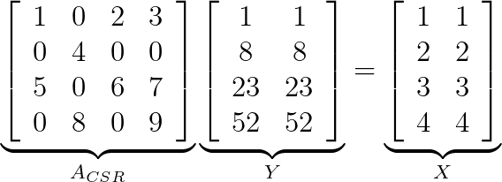

# cuSPARSE Generic APIs - `cusparseSpSM CSR`

## Description

This sample demonstrates the usage of `cusparseSpSM` for performing *sparse triangular solver with multiple right-hand sides*, where the sparse matrix is represented in CSR (Compressed Sparse Row) storage format. The solver is configured with `CUSPARSE_FILL_MODE_LOWER` for the fill mode, indicating that only the lower triangular part of the matrix is used, and `CUSPARSE_DIAG_TYPE_NON_UNIT` for the diagonal type.

[cusparseSpSM Documentation](https://docs.nvidia.com/cuda/cusparse/index.html#cusparse-generic-function-spsm)

<center>

`op(A) * X = alpha * op(Y)`, where `X` is the output dense matrix and `op(Y)` is the input dense matrix (RHS). 


</center>

## Building

* Command line
    ```bash
    nvcc -I<cuda_toolkit_path>/include spsm_csr_example.c -o spsm_csr_example -lcusparse
    ```

* Linux
    ```bash
    make
    ```

* Windows/Linux
    ```bash
    mkdir build
    cd build
    cmake ..
    make
    ```
    On Windows, instead of running the last build step, open the Visual Studio Solution that was created and build.

## Support

* **Supported SM Architectures:** SM 3.5, SM 3.7, SM 5.0, SM 5.2, SM 5.3, SM 6.0, SM 6.1, SM 6.2, SM 7.0, SM 7.2, SM 7.5, SM 8.0, SM 8.6, SM 8.9, SM 9.0
* **Supported OSes:** Linux, Windows, QNX, Android
* **Supported CPU Architectures**: x86_64, ppc64le, arm64
* **Supported Compilers**: gcc, clang, Intel icc, IBM xlc, Microsoft msvc, Nvidia HPC SDK nvc
* **Language**: `C99`

## Prerequisites

* [CUDA 11.3.1 toolkit](https://developer.nvidia.com/cuda-downloads) (or above) and compatible driver (see [CUDA Driver Release Notes](https://docs.nvidia.com/cuda/cuda-toolkit-release-notes/index.html#cuda-major-component-versions)).
* [CMake 3.9](https://cmake.org/download/) or above on Windows
