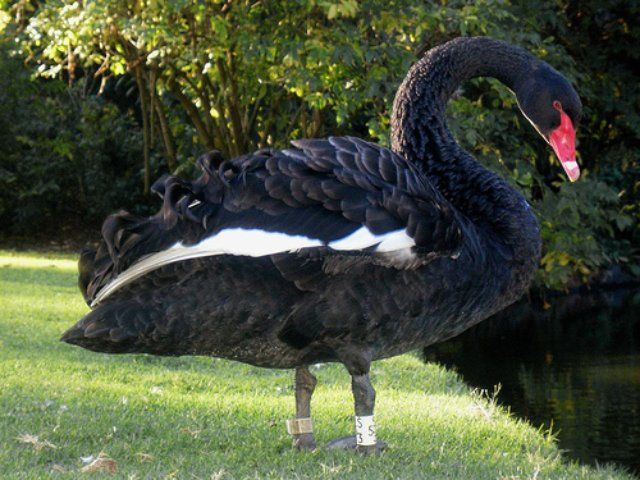
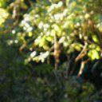

# nvJPEG-Decoder-DifferentBackEnd

## Description
The sample codes shows the usage of decouple nvJPEG API on decoding JPEG images. Extra functionalities including different backends and ROI are supported.

## Key Concepts
Image Decoding, different backends from NVJPEG Library

## Supported SM Architecture 
SM 3.0 SM 3.5 SM 3.7 SM 5.0 SM 5.2 SM 6.0 SM 6.1 SM 7.0 SM 7.2 SM 7.5 8.0

## Supported OS
Linux, Windows

## Supported CPU Architecture
x86_64

## CUDA APIs involved
NVJPEG

# Prerequisites
- A Linux/Windows system with recent NVIDIA drivers.
- Install the [CUDA 11.2 Update 1 toolkit](https://developer.nvidia.com/cuda-downloads) 

# Building
Build command
```
$ mkdir build
$ cd build
$ cmake ..
$ make
```

# Usage
```
Usage: ./nvJPEGROIDecode -i images_dir [-roi roi_regions] [-backend backend_enum] [-b batch_size] [-t total_images] [-w warmup_iterations] [-o output_dir] [-pipelined] [-batched] [-fmt output_format]
Parameters: 
        images_dir      :       Path to single image or directory of images
        roi_regions     :       Specify the ROI in the following format [x_offset, y_offset, roi_width, roi_height]
        backend_eum     :       Type of backend for the nvJPEG (0 - NVJPEG_BACKEND_DEFAULT, 1 - NVJPEG_BACKEND_HYBRID,
                                2 - NVJPEG_BACKEND_GPU_HYBRID)
        batch_size      :       Decode images from input by batches of specified size
        total_images    :       Decode this much images, if there are less images 
                                        in the input than total images, decoder will loop over the input
        warmup_iterations       :       Run this amount of batches first without measuring performance
        output_dir      :       Write decoded images as BMPs to this directory
        pipelined       :       Use decoding in phases
        batched         :       Use batched interface
        output_format   :       nvJPEG output format for decoding. One of [rgb, rgbi, bgr, bgri, yuv, y, unchanged]
```

# Example 1 - Choosing different backend
**Default Backend**
<br />
Command: ./nvJPEGROIDecode -i ../input_images/ -backend 0
```
...
...
Total decoding time: 0.0136991 (s)
Avg decoding time per image: 0.00114159 (s)
Avg images per sec: 875.972
Avg decoding time per batch: 0.00114159 (s)
```

**Hybrid BackEnd**
<br />
Command: ./nvJPEGROIDecode -i ../input_images/ -backend 1
```
...
...
Total decoding time: 0.0138813 (s)
Avg decoding time per image: 0.00115678 (s)
Avg images per sec: 864.47
Avg decoding time per batch: 0.00115678 (s)
```

**GPU Backend**
<br />
Command: ./nvJPEGROIDecode -i ../input_images/ -backend 2
```
...
...
Total decoding time: 0.0166718 (s)
Avg decoding time per image: 0.00138931 (s)
Avg images per sec: 719.779
Avg decoding time per batch: 0.00138931 (s)
```

# Example 2 - Decode with ROI
Command: ./nvJPEGROIDecode -i ../input_images/ -roi 0,0,64,64

Original image: 
<br />

<br />
<br />
Result: 
<br />

